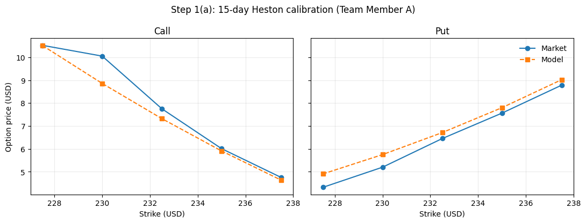
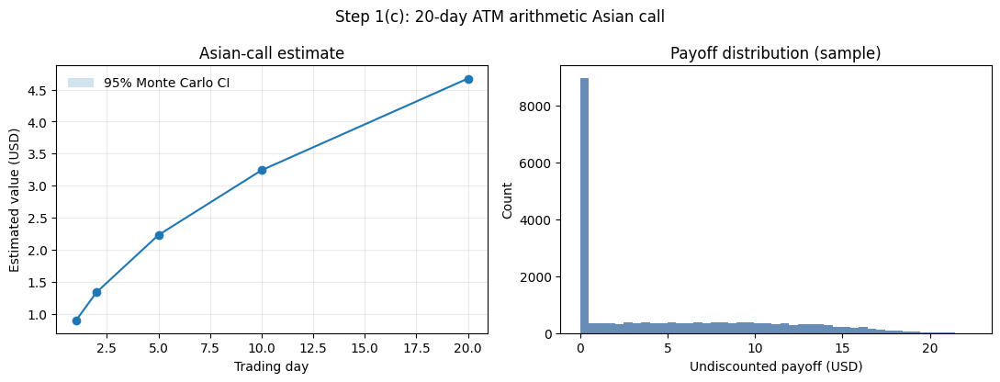
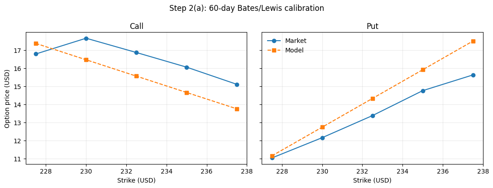
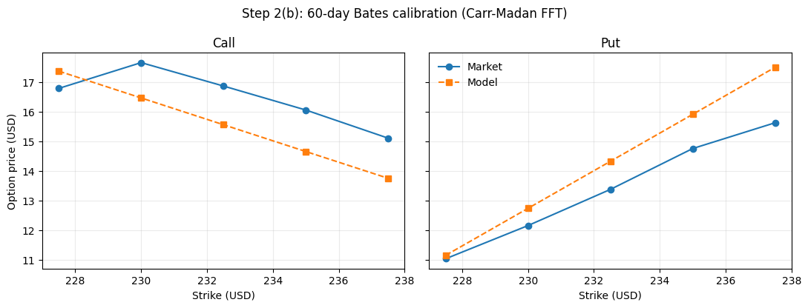
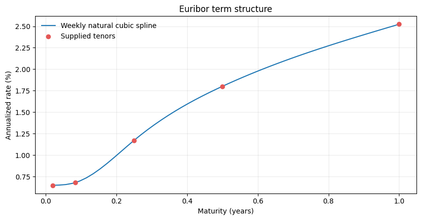
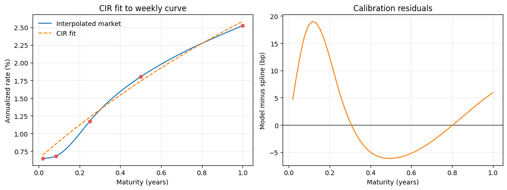
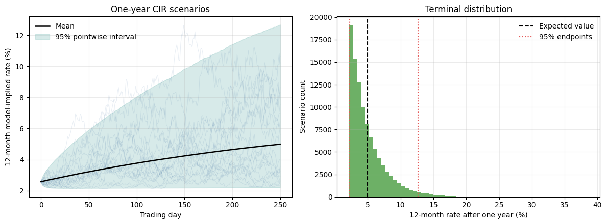

# MScFE 622 Stochastic Modeling — Group Work Project 1

## Group report

*Cover page, team names, and student numbers to be added using the WorldQuant University report template before submission.*

## Team and scope

We are a group of two, so the brief tells us to use the roles of Team Members A and C. The work splits as follows.

| Step | Task | Owner | Status |
|---|---|---|---|
| 1(a) | Calibrate Heston (1993) at 15 days using Lewis (2001) | Member A | Complete |
| 1(b) | Carr–Madan version of Step 1(a) | Member B | Not required for a group of two |
| 1(c) | Price the 20-day at-the-money Asian call | Member C | Complete |
| 2(a) | Calibrate Bates (1996) at 60 days using Lewis (2001) | Member C | Complete |
| 2(b) | Carr–Madan version of Step 2(a) | Member A | Complete |
| 2(c) | 70-day put at 95% moneyness | Member B | Not required for a group of two |
| 3(a) | Build the Euribor curve and calibrate CIR (1985) | Shared | Complete |
| 3(b) | Simulate 12-month Euribor for one year | Shared | Complete |

All required tasks are complete. The only remaining item before submission is the cover page from the WorldQuant University report template.

## Data and assumptions

| Input | Value |
|---|---:|
| SM spot price | \$232.90 |
| Annual risk-free rate | 1.50% |
| Trading days per year | 250 |
| Dividend yield | 0% (none was given) |
| Calibration error measure | Plain unweighted mean squared price error |
| Option prices | 30 quotes: calls and puts at 15, 60, and 120 days |
| Euribor rates | Five tenors, one week to twelve months, converted from ACT/360 simple quotes to zero rates |

The notebook reads the 30 option quotes straight from the supplied workbook instead of copying them into the code, so every option result can be traced back to the original file. The Euribor rates are printed as a table in the brief and are typed in from there, then converted to continuously compounded zero rates before anything is fitted to them.

## Step 1(a): 15-day Heston calibration

*Prepared by Team Member A.*

### Method

Everything in this section is reproduced by the group notebook, which re-runs Team Member A's original calibration code rather than restating its results. The run takes roughly 15–20 minutes because each objective evaluation prices ten options by adaptive quadrature.

The client's first idea was a short-dated Asian option, around 15 days. To price it we need a model fitted at that maturity, so Team Member A calibrated the classic Heston (1993) model, without jumps, to the ten vanilla quotes at 15 days: five calls and five puts, strikes 227.5 to 237.5. Maturity is 15/250 = 0.06 years.

Call prices come from the Heston characteristic function under the Lewis (2001) integral, evaluated numerically. Put prices come from put–call parity, P = C − S₀ + K·e^(−rT), which is the approach the brief prefers. All ten quotes go into a single mean squared error, with calls and puts weighted equally. The optimiser is Nelder–Mead started from several different points, which reduces the chance of settling in a poor local minimum, with the usual admissibility limits (κᵥ, θᵥ, σᵥ, v₀ ≥ 0 and −1 ≤ ρ ≤ 1).

A second version was tested with v₀ tied to θᵥ. That is a common simplification when only one maturity is available, because the two parameters are hard to tell apart. It fitted worse, MSE 0.2877 against 0.2460, and it did not fix the boundary behaviour in ρ described below, so the free five-parameter fit is the one we report.

### Calibrated parameters

| Parameter | Symbol | Value | What it means |
|---|---|---:|---|
| Mean-reversion speed | κᵥ | 6.278644 | How fast variance returns to its long-run level |
| Long-run variance | θᵥ | 0.151172 | Average variance over the long run |
| Vol-of-vol | σᵥ | 1.377790 | Volatility of the variance process itself |
| Correlation | ρ | −0.998875 | Spot–variance correlation, the leverage effect |
| Initial variance | v₀ | 0.091834 | Variance at time zero |

The fit gives MSE 0.245955. The Feller condition, 2κᵥθᵥ > σᵥ², only barely holds: 1.8983103 against 1.8983053, a margin of about 0.000005. The optimiser has pushed the variance process right onto the boundary where strictly positive variance stops being guaranteed.

### How well it fits

| Strike | Market call | Model call | Error | Market put | Model put | Error |
|---:|---:|---:|---:|---:|---:|---:|
| 227.5 | 10.520 | 10.510 | −0.010 | 4.320 | 4.905 | +0.585 |
| 230.0 | 10.050 | 8.857 | −1.193 | 5.200 | 5.750 | +0.550 |
| 232.5 | 7.750 | 7.320 | −0.430 | 6.450 | 6.710 | +0.260 |
| 235.0 | 6.010 | 5.908 | −0.102 | 7.560 | 7.797 | +0.237 |
| 237.5 | 4.750 | 4.633 | −0.117 | 8.780 | 9.019 | +0.239 |

The model tracks the level and slope of both curves well. The worst point is the 230 call, where the model sits \$1.19 below the market. Everything else is within about \$0.60. Puts fit slightly worse than calls, and the model prices every put a little above the market.

Two things stand out in the parameters. The correlation has run to the edge of what is allowed, −0.998875, and both κᵥ and σᵥ are large. The Feller margin is effectively zero, so the variance process sits right on the boundary where strictly positive variance stops being guaranteed.

This is what single-maturity calibration usually looks like. With only one maturity, v₀ and θᵥ both mainly control the average variance over a short horizon, so the optimiser cannot separate them; it then leans on an extreme correlation and a high vol-of-vol to reproduce the observed skew. This is a limit of the data, not a coding error.

Two later sections follow this up rather than repeating it here. Step 2(b) tests the implementations directly, by pricing one parameter set through two independent Fourier engines. Step 1(c) measures what the loose identification costs on the price quoted to the client.

### Reproducibility

Team Member A's calibration is not transcribed into the group notebook as a set of numbers. It is re-run there from their own code and reproduces their published parameters exactly, and the notebook asserts this, so the result cannot drift silently if anything upstream changes.

## Step 1(c): 20-day ATM Asian call

*Prepared by Team Member C.*

### How we priced it

We checked the pricing engine before trusting it. If you feed the Lewis integral a constant-volatility characteristic function, it should return the Black–Scholes price. It does: for a 60-day at-the-money call at 25% volatility we get \$11.77537458 against the closed-form \$11.77537457. The two agree to seven decimals, so any pricing error later comes from the model or the data, not from the numerical integration.

The Asian price uses Team Member A's 15-day parameters from Step 1(a), taken at full precision straight from the calibration the notebook runs rather than from rounded published values.

The option is at the money, so the strike is \$232.90, and maturity is 20/250 of a year. We simulated the share price and its variance together under the risk-neutral measure, one step per trading day. Full truncation keeps the simulated variance from going negative. The average that decides the payoff uses 21 prices: today's price plus the next 20 daily prices, as the brief requires. The payoff is the amount by which that average beats \$232.90, or zero. We ran 200,000 paths with antithetic sampling and measured the error from the paired results.

| Output | Result |
|---|---:|
| Risk-neutral fair value | **\$4.6718** |
| Monte Carlo standard error | \$0.0069 |
| 95% Monte Carlo interval | \$4.6583 to \$4.6853 |
| Share of paths paying off | 56.56% |
| Bank fee, 4% of fair value | \$0.1869 |
| **Final client price** | **\$4.8587** |

The interval is narrow, so we have run enough simulations. But that number only measures simulation noise. It says nothing about whether the calibration itself is right, and Step 1(a) showed that the parameters behind it are not sharply identified. We recommend quoting **\$4.86 per option unit**.

### How much does the calibration matter?

The interval above measures Monte Carlo sampling error only. It says nothing about whether the parameters behind the price are right, and Step 1(a) showed that the 15-day quotes fit well without pinning those parameters down tightly.

To size what that is worth on this quote, we refit the same 15-day Heston model independently, using a different optimiser and a different pricing routine, then reprice the Asian under both parameter sets. The refit is used only for this comparison; the quoted price uses Team Member A's parameters.

The refit lands on MSE 0.246085 against 0.246064 for Team Member A's parameters priced through the same engine — the same fit quality to four decimals. It gets there with a clearly different parameter set.

| Parameter | Team Member A | Independent refit | Difference |
|---|---:|---:|---:|
| κ | 6.278644 | 4.365365 | 1.913278 |
| θ | 0.151172 | 0.216947 | 0.065776 |
| σᵥ | 1.377790 | 1.374890 | 0.002899 |
| ρ | −0.998875 | −0.980000 | 0.018875 |
| v₀ | 0.091834 | 0.086222 | 0.005612 |

The two sets price all ten vanilla options within \$0.0013 of each other, so the market quotes cannot tell them apart. They price the Asian at \$4.6718 and \$4.6171 — a gap of **\$0.0547, or 7.9 times the \$0.0069 simulation error**.

That is the honest measure of what we do not know about this quote. The margin should be set against the five-and-a-half-cent calibration gap, not against the sub-cent Monte Carlo error.

This comparison also doubles as an implementation check. Team Member A's parameters priced through this notebook's Gauss-Legendre engine give MSE 0.246064 against 0.245955 from their own adaptive-quadrature engine, with no option differing by more than \$0.0009. Two independently written pricers agree, which rules out a bug in the characteristic function or the integral in either one.

### For the client

We started by matching our pricing assumptions to the prices of ordinary SM options already trading in the market. We then generated a very large number of realistic paths for the SM share price over the next 20 trading days. For each path we took the average of today's price and the 20 daily prices that follow, then worked out how much, if anything, that average beat \$232.90 by. Averaging those amounts and bringing them back to today's money gives a fair value of about \$4.67. Our 4% fee adds about \$0.19, so the price to you is about **\$4.86**. If the market moves before you trade, we will requote.

## Step 2(a): 60-day Bates calibration using Lewis pricing

*Prepared by Team Member C.*

### How the calibration was set up

The Bates model takes stochastic volatility and adds sudden jumps in the share price, with jump sizes drawn from a lognormal distribution (Bates). We priced calls with the Lewis single-integral formula, which recovers an option value from the characteristic function (Lewis), and got put prices from put–call parity. All five 60-day calls and all five 60-day puts went into one plain unweighted price-MSE objective. We ran a seeded global search first, then bounded nonlinear least squares to polish it. The variance parameters were held to the Feller positivity condition throughout.

The data itself stops us from fitting everything well. The 60-day call price *rises* from \$16.78 at a strike of \$227.50 to \$17.65 at a strike of \$230.00, and a call should get cheaper as the strike rises, not dearer. On top of that, the calls and puts disagree with each other by up to \$3.2265. Because we generate put prices by parity, those disagreements set a floor: no model of this kind can score better than an MSE of **1.2694** on this data.

### Parameter estimates

| Parameter | Estimate | What it means |
|---|---:|---|
| κ | 4.187824 | How fast variance pulls back to its long-run level |
| θ | 0.002500 | Long-run variance |
| σᵥ | 0.016364 | Volatility of the variance itself |
| ρ | −0.925688 | Correlation between price and variance shocks |
| v₀ | 0.002500 | Starting variance |
| λ | 1.879535 | Expected number of jumps per year |
| μⱼ | 0.213505 | Average size of a jump, in log terms |
| δⱼ | 0.010000 | Spread of jump sizes, in log terms |

The positivity margin, 2κθ − σᵥ², is 0.020671. Three estimates sit on their lower bounds: θ, v₀, and δⱼ. That is a warning sign. Ten prices at a single maturity, and inconsistent ones at that, cannot pin down eight separate parameters.

### How well it fits

| Fit measure | Result |
|---|---:|
| MSE | 1.3352 |
| RMSE | \$1.1555 |
| MAE | \$1.0508 |
| Largest single price error | \$1.8718 |
| Floor implied by parity errors | 1.2694 |

Compare the MSE of 1.3352 with the floor of 1.2694: about 95% of our error was unavoidable given the data. Only the last 5% is down to the model and the fitting.

We refitted with a different seed to test how solid the parameters are. The MSE barely moved, from 1.3352 to 1.3351, and the fitted price curve looked almost the same. But κ shifted from 4.19 to 1.77 and σᵥ from 0.016 to 0.079. The lesson is the same one Step 1(a) produced at 15 days: the *price curve* is well determined here, while the individual parameters are not.

### Comparing the two maturities

Team Member A asked that the 15-day parameters be checked against the longer maturities. Putting them side by side:

| Parameter | 15-day Heston, no jumps | 60-day Bates, with jumps |
|---|---:|---:|
| κ | 6.278644 | 4.187824 |
| θ | 0.151172 | 0.002500 |
| σᵥ | 1.377790 | 0.016364 |
| ρ | −0.998875 | −0.925688 |

These do not look like the same process, and the reason is the jumps. In the 15-day fit there are no jumps available, so the diffusion has to generate the whole smile on its own. It does that with a high long-run variance (θ = 0.151172, roughly 39% volatility) and a very high vol-of-vol. Once jumps are allowed at 60 days, they take over that job: the model puts about 1.88 jumps a year with an average log size of 0.21 and lets the diffusive variance collapse to its lower bound. So the two calibrations tell a consistent story about the *prices*, but they split the same risk between diffusion and jumps in completely different ways. That is another reason to compare prices rather than parameters across maturities.

### For the client

For a 60-day contract we tuned our pricing assumptions to the ten SM option prices quoted at that maturity. Those quotes do not agree with each other. One call is quoted above a cheaper-strike call, which should not happen, and the calls and puts imply prices that differ by as much as \$3.23. When the market data contradicts itself, no single set of assumptions can match all of it, and we are left with an average gap of about \$1.16 per option. Around 95% of that gap is forced on us by the quotes themselves. In practice this means 60-day SM business should carry a wider margin than the fitted numbers alone suggest, and we should refresh the inputs once we have cleaner market data.

## Step 2(b): 60-day Bates calibration using Carr–Madan pricing

*Prepared by Team Member A.*

### Method

This step re-does Step 2(a) with a structurally different pricing method, as a check on the first result.

Lewis evaluates one damped integral per strike using fixed Gauss–Legendre nodes. Carr and Madan instead multiply the call price by e^(αk) in log-strike k = ln K, which makes it square integrable, and then recover the entire strike curve in a single FFT (Carr and Madan). We used the standard grid from their paper, N = 4096 points with spacing η = 0.25 and damping α = 1.5, and interpolated off the FFT grid onto the five quoted strikes with a cubic spline.

Both pricers are given **the same Bates characteristic function**, so any price difference is numerical, not a difference in the model. Everything else is held identical to Step 2(a): the same ten 60-day quotes, puts by put–call parity, the same unweighted price MSE, the same parameter bounds, and the same global search with the same random seed and iteration budget. The pricing method is the only thing that changes.

### First check: same parameters, both methods

Before comparing calibrations, we priced Step 2(a)'s fitted parameters through both engines.

| Strike | Lewis | Carr–Madan | Difference |
|---:|---:|---:|---:|
| 227.5 | 17.362554 | 17.362546 | −0.000008 |
| 230.0 | 16.458058 | 16.458053 | −0.000005 |
| 232.5 | 15.553654 | 15.553662 | +0.000008 |
| 235.0 | 14.649340 | 14.649339 | −0.000000 |
| 237.5 | 13.745238 | 13.745229 | −0.000009 |

The largest gap is \$0.0000089, which is quadrature noise between two different numerical schemes. Neither implementation has an error in the characteristic function or the transform.

### Independent Carr–Madan calibration

| Parameter | Estimate |
|---|---:|
| κ | 14.311920 |
| θ | 0.002500 |
| σᵥ | 0.026239 |
| ρ | −0.976588 |
| v₀ | 0.002500 |
| λ | 1.879550 |
| μⱼ | 0.213504 |
| δⱼ | 0.010000 |

### Do the two methods agree?

**On prices and fit quality, exactly.**

| Fit measure | Lewis (2001) | Carr–Madan (1999) |
|---|---:|---:|
| MSE | 1.335154 | 1.335153 |
| RMSE | \$1.155489 | \$1.155488 |
| MAE | \$1.050763 | \$1.050767 |
| Largest single error | \$1.871775 | \$1.871751 |

The two fitted price curves differ by at most \$0.000024 across all ten options, and the RMSE agrees to six decimals. This is the answer the desk needs: the two methods price the same book identically.

**On parameters, not at all — and this is the most striking result in the project.**

| Parameter | Lewis | Carr–Madan | Difference |
|---|---:|---:|---:|
| κ | 4.187824 | 14.311920 | **10.124096** |
| θ | 0.002500 | 0.002500 | 0.000000 |
| σᵥ | 0.016364 | 0.026239 | 0.009875 |
| ρ | −0.925688 | −0.976588 | 0.050900 |
| v₀ | 0.002500 | 0.002500 | 0.000000 |
| λ | 1.879535 | 1.879550 | 0.000015 |
| μⱼ | 0.213505 | 0.213504 | 0.000001 |
| δⱼ | 0.010000 | 0.010000 | 0.000000 |

The mean-reversion speed differs by a factor of more than three, yet the prices are identical to five decimal places.

There is a clean mechanical reason, and it is worth stating precisely rather than filing under "weak identification". Both fits push θ and v₀ onto their lower bound of 0.0025. That means the variance process **starts at its own long-run level**, so its drift term κ(θ − v) is zero at inception and stays near zero. The only thing that can move the variance is the σᵥ√v term, and with √v ≈ 0.05 and σᵥ around 0.02, that is worth roughly 0.001 a year — negligible. The variance is effectively frozen at 0.0025, which is a flat 5% volatility.

Once variance is frozen, **κ has almost nothing to act on.** It is the speed of reversion toward a level the process is already sitting at. Whether it is 4.19 or 14.31 changes the option prices in the fifth decimal. The optimiser is free to wander along that direction of the parameter space at no cost, and two searches differing only in their pricing routine stop at different points.

The jump parameters tell the other half of the story. λ, μⱼ, and δⱼ agree between the two calibrations to five decimal places or better. They are what actually fits this data: the model has become, in effect, a jump model with a nearly constant diffusive volatility, and the jump block is well identified precisely because it is doing all the work.

So the answer to the question the brief asks — do you obtain similar parameter values, and why or why not — is: **no for the diffusion parameters, yes for the jump parameters, and the split is explained by which parts of the model the data can actually see.** A parameter gap here is not evidence that either implementation is wrong. The check that would have exposed a bug is the first one above, identical parameters producing different prices, and it passes to within a hundredth of a cent.

## Step 3(a): Euribor curve and CIR calibration

*Shared work.*

### Building the curve

Euribor is quoted as a simple-interest rate on an ACT/360 basis, so the five numbers in the brief are not zero rates and a short-rate model cannot be fitted to them directly. The brief asks us to build the term structure properly, so we convert first. Each quote L over its accrual factor τ gives a discount factor P = 1/(1 + Lτ), and the continuously compounded zero rate is y = −ln(P)/τ.

| Tenor | Quoted Euribor | Discount factor | Zero rate |
|---|---:|---:|---:|
| 1 week | 0.648% | 0.999874 | 0.6480% |
| 1 month | 0.679% | 0.999434 | 0.6788% |
| 3 months | 1.173% | 0.997076 | 1.1713% |
| 6 months | 1.809% | 0.991036 | 1.8009% |
| 12 months | 2.556% | 0.975077 | 2.5239% |

The correction is negligible at the short end and grows with maturity, reaching 3.2 basis points at twelve months. That is worth doing rather than skipping: the fitted curve error below is under 8 basis points, so a 3 basis point bias concentrated at the long end would be a material share of it, and the long end is exactly what sets the level the model reverts to.

We fitted a natural cubic spline through the five zero rates and read it off at weeks 1 to 52, as the brief asks. The one-week zero rate, 0.6480%, becomes the starting short rate. We then fitted the three CIR parameters to those 52 weekly yields using the CIR zero-coupon bond formula. CIR gives a term structure we can write down in closed form while keeping rates from going negative (Cox, Ingersoll, and Ross).

| CIR parameter | Estimate |
|---|---:|
| Mean-reversion speed, κ | 0.756410 |
| Long-run short-rate level, θ | 0.071964 (7.1964%) |
| Short-rate volatility, σ | 0.329622 |
| Starting short rate, r₀ | 0.006480 (0.6480%) |

The fit is off by 7.8653 basis points RMSE across the weekly grid. The Feller margin is positive but thin at 0.000218, so the process sits close to the boundary where rates could touch zero. At the one-year point the model gives 2.5832% against the market zero rate of 2.5239%.

The model captures the upward slope, but read the parameters with care for two reasons. First, the spline gives us the weekly grid the brief asks for; it does not turn five market observations into 52. Second, fitting one snapshot of the curve tells us about risk-neutral pricing dynamics, not about how rates behave in the real world.

## Step 3(b): one-year 12-month Euribor scenarios

*Shared work.*

We simulated 100,000 scenarios over 250 daily steps. Rather than approximating the CIR process with Euler steps, we drew from its exact noncentral chi-square transition, which keeps every simulated rate at or above zero by construction. On each day we converted that day's short rate into the model's one-year zero yield and used it as the 12-month Euribor.

| Output | Result |
|---|---:|
| Simulations | 100,000 |
| Confidence level | 95% |
| Current 12-month Euribor (zero rate) | 2.5239% |
| Expected 12-month rate in one year | **4.9942%** |
| 95% range at the one-year point | **2.2079% to 12.6778%** |
| Widest daily 95% band | 2.1616% to 12.6778% |

The expected rate sits 2.470 percentage points above today's 2.5239%. If rates do rise that far, future cash flows get discounted harder. Holding spot, volatility, dividends, and contract terms fixed, higher risk-free rates usually lift call values and depress put values, working through both the forward price and the discount factor. The size of the effect on any particular product still depends on its payoff and on the whole future curve, not on one rate.

Treat these as **risk-neutral pricing scenarios**, not as a forecast and not as a guaranteed range. The long upper tail comes from the large rate volatility the model needs in order to match today's steep curve. Neither our risk limits nor our client material should present the 95% range as a certainty.

### For the client

Borrowing euros for twelve months costs about 2.52% a year today. Starting from the shape of the current euro rate curve, we generated a very large number of ways rates could move over the next year. On average those scenarios put the twelve-month rate near 4.99% a year from now, and 95% of them land between roughly 2.21% and 12.68%.

Two things follow. First, if borrowing costs do climb, money you receive later is worth less today. That tends to raise the value of contracts that gain when prices rise, and lower the value of contracts bought as protection against falls. Second, the top of that range is very wide. The width reflects how steep the current curve is, and it should be read as a span you should be ready for, not as a prediction of where rates will end up.

## What we take away

1. **The price curves are reliable; the parameters are not.** We showed this four separate ways: two independent 15-day calibrations that price within \$0.0013 of each other but differ by 1.91 in κ; two seeds at 60 days that match on MSE but differ by a factor of five in σᵥ; a 15-day fit that loads risk onto diffusion where the 60-day fit loads it onto jumps; and, most starkly, Lewis and Carr–Madan producing **identical prices to five decimals** at 60 days with κ differing by 10.12. Any discussion of these models should lead with prices.
2. **The supplied option data is not arbitrage-free.** One 60-day call rises with strike, and put–call parity is violated by up to \$3.23. About 95% of our 60-day fitting error is forced by this and cannot be removed by any better model.
3. **Calibration risk dominates simulation risk on the Asian option.** The Monte Carlo error is \$0.0069. Switching between two equally good calibrations moves the price by \$0.0547, 7.9 times larger.

## Recommendations

1. Quote the Asian option at **\$4.86 per unit**, and set the margin against calibration uncertainty of roughly \$0.055, not against the \$0.0069 simulation error.
2. Read the Lewis and Carr–Madan results as a price comparison, which they pass exactly. Do not read the parameter gap as a disagreement between the methods.
3. Keep the quote-quality diagnostics in the report. Without them, the fitting error and the parameters sitting on their bounds look unexplained.
4. Treat the CIR results as risk-neutral pricing scenarios. Add historical or macroeconomic evidence before using them as a real-world view.
5. Re-run the calibrations once cleaner SM option quotes are available, ideally across more than one maturity, which is the only real fix for the identification problem.

## Works Cited

Bates, David S. “Jumps and Stochastic Volatility: Exchange Rate Processes Implicit in Deutsche Mark Options.” *The Review of Financial Studies*, vol. 9, no. 1, 1996, pp. 69–107. Oxford UP, https://doi.org/10.1093/rfs/9.1.69.

Carr, Peter, and Dilip B. Madan. “Option Valuation Using the Fast Fourier Transform.” *Journal of Computational Finance*, vol. 2, no. 4, 1999, pp. 61–73, https://doi.org/10.21314/JCF.1999.043.

Cox, John C., Jonathan E. Ingersoll, Jr., and Stephen A. Ross. “A Theory of the Term Structure of Interest Rates.” *Econometrica*, vol. 53, no. 2, 1985, pp. 385–407, https://doi.org/10.2307/1911242.

Heston, Steven L. “A Closed-Form Solution for Options with Stochastic Volatility with Applications to Bond and Currency Options.” *The Review of Financial Studies*, vol. 6, no. 2, 1993, pp. 327–343, https://doi.org/10.1093/rfs/6.2.327.

Lewis, Alan L. “A Simple Option Formula for General Jump-Diffusion and Other Exponential Lévy Processes.” Sept. 2001. *SSRN*, https://doi.org/10.2139/ssrn.282110.
