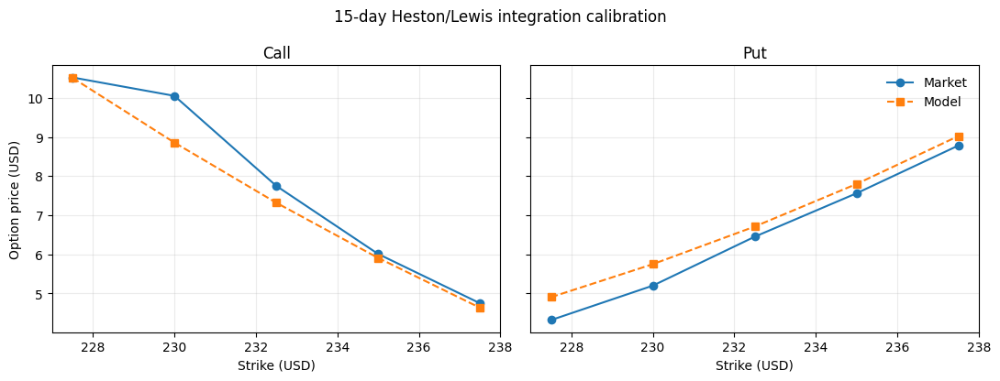
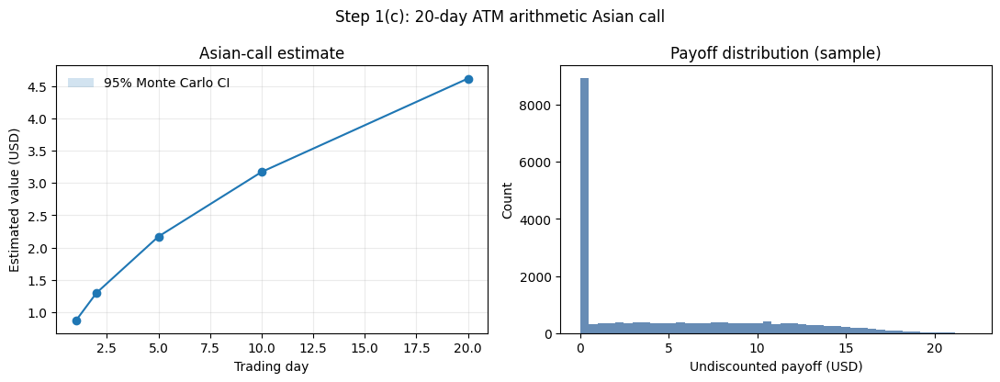
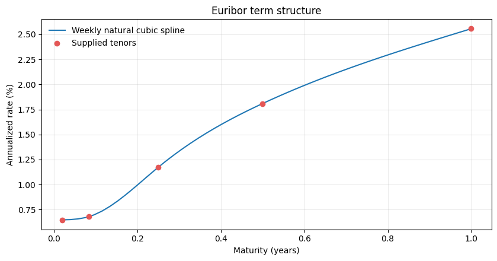
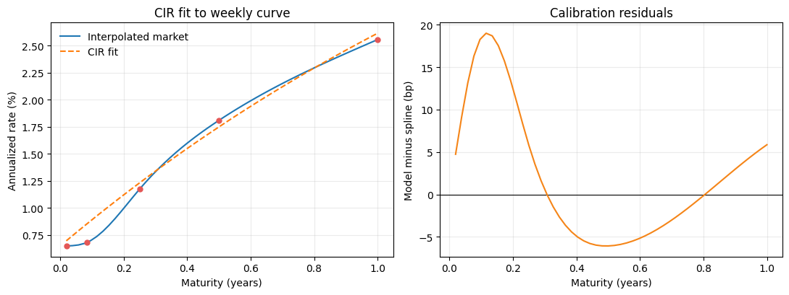
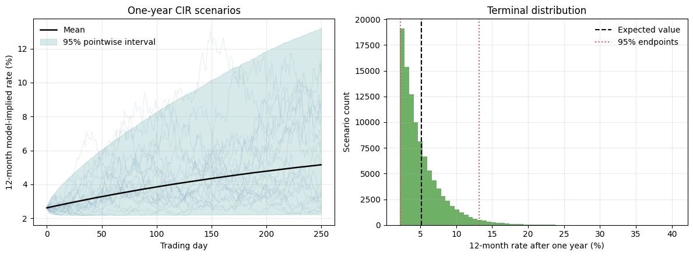

# MScFE 622 Group Work Project 1
## Team Member C and Shared Step 3 - Report Integration Draft

This draft holds the sections owned by Team Member C in a two-person group, plus the shared Step 3 work. It is not the final group report. Team Member A's Step 1(a) and Step 2(b) sections, the cover-page template, the team details, and the Carr–Madan comparison still need to be added.

## Scope and assumptions

For a group of two, the brief says to use the roles of Members A and C. This draft therefore covers Step 1(c), Step 2(a), Step 3(a), and Step 3(b). Step 2(c), the 70-day put, belongs to Member B and is not required.

| Input | Value |
|---|---:|
| SM spot price | \$232.90 |
| Annual risk-free rate | 1.50% |
| Trading days per year | 250 |
| Dividend yield | 0% (none was given) |
| Calibration error measure | Plain unweighted mean squared price error |
| Option prices | 30 quotes: calls and puts at 15, 60, and 120 days |
| Euribor rates | Five tenors, from one week to twelve months |

The notebook reads the 30 option quotes straight from the supplied workbook instead of copying them into the code. Every option result below can therefore be traced back to the original file. The Euribor rates come from the table printed in the brief and are typed in from there.

## Step 1(c): 20-day ATM Asian call

### How we priced it

We checked the pricing engine before trusting it. If you feed the Lewis integral a constant-volatility characteristic function, it should return the Black–Scholes price. It does: for a 60-day at-the-money call at 25% volatility we get \$11.77537458 against the closed-form \$11.77537457. The two agree to seven decimals, so any pricing error later comes from the model or the data, not from the numerical integration.

The Asian price needs the 15-day calibration from Step 1. Team Member A's final numbers were not ready when this draft was written, so we used our own 15-day Lewis calibration as a clearly marked stand-in: κ = 4.365365, θ = 0.216947, σ = 1.374890, ρ = −0.980000, v₀ = 0.086222. These satisfy the variance-positivity condition, with a margin of 0.003786. **They must be swapped for Member A's approved values before the group submits.**

The option is at the money, so the strike is \$232.90, and maturity is 20/250 of a year. We simulated the share price and its variance together under the risk-neutral measure, one step per trading day. Full truncation keeps the simulated variance from going negative. The average that decides the payoff uses 21 prices: today's price plus the next 20 daily prices, as the brief requires. The payoff is the amount by which that average beats \$232.90, or zero. We ran 200,000 paths with antithetic sampling and measured the error from the paired results. The stochastic-volatility set-up follows Heston.

| Output | Result |
|---|---:|
| Risk-neutral fair value | **\$4.6171** |
| Monte Carlo standard error | \$0.0069 |
| 95% Monte Carlo interval | \$4.6037 to \$4.6305 |
| Share of paths paying off | 56.57% |
| Bank fee, 4% of fair value | \$0.1847 |
| **Final client price** | **\$4.8018** |

The interval is narrow, so we have run enough simulations. But that number only measures simulation noise. It says nothing about whether the calibration itself is right. We recommend quoting **\$4.80 per option unit**, on the condition that we rerun the notebook with Member A's final parameters and confirm the price does not move much.

### For the client

We started by matching our pricing assumptions to the prices of ordinary SM options already trading in the market. We then generated a very large number of realistic paths for the SM share price over the next 20 trading days. For each path we took the average of today's price and the 20 daily prices that follow, then worked out how much, if anything, that average beat \$232.90 by. Averaging those amounts and bringing them back to today's money gives a fair value of about \$4.62. Our 4% fee adds about \$0.18, so the price to you is about **\$4.80**. If the market moves before you trade, we will requote.

## Step 2(a): 60-day Bates calibration using Lewis pricing

### How the calibration was set up

The Bates model takes stochastic volatility and adds sudden jumps in the share price, with jump sizes drawn from a lognormal distribution (Bates). We priced calls with the Lewis single-integral formula, which recovers an option value from the characteristic function (Lewis), and got put prices from put–call parity. All five 60-day calls and all five 60-day puts went into one plain unweighted price-MSE objective. We ran a seeded global search first, then bounded nonlinear least squares to polish it. The variance parameters were held to the Feller positivity condition throughout.

The data itself stops us from fitting everything well. The 60-day call price *rises* from \$16.78 at a strike of \$227.50 to \$17.65 at a strike of \$230.00, and a call should get cheaper as the strike rises, not dearer. On top of that, the calls and puts disagree with each other by up to \$3.2265. Because we generate put prices by parity, those disagreements set a floor: no model of this kind can score better than an MSE of **1.2694** on this data.

### Parameter estimates

| Parameter | Estimate | What it means |
|---|---:|---|
| κ | 4.187824 | How fast variance pulls back to its long-run level |
| θ | 0.002500 | Long-run variance |
| σᵥ | 0.016364 | Volatility of the variance itself |
| ρ | −0.925688 | Correlation between price and variance shocks |
| v₀ | 0.002500 | Starting variance |
| λ | 1.879535 | Expected number of jumps per year |
| μⱼ | 0.213505 | Average size of a jump, in log terms |
| δⱼ | 0.010000 | Spread of jump sizes, in log terms |

The positivity margin, 2κθ − σᵥ², is 0.020671. Three estimates sit on their lower bounds: θ, v₀, and δⱼ. That is a warning sign. Ten prices at a single maturity, and inconsistent ones at that, cannot pin down eight separate parameters.

### How well it fits

| Fit measure | Result |
|---|---:|
| MSE | 1.3352 |
| RMSE | \$1.1555 |
| MAE | \$1.0508 |
| Largest single price error | \$1.8718 |
| Floor implied by parity errors | 1.2694 |

Compare the MSE of 1.3352 with the floor of 1.2694: about 95% of our error was unavoidable given the data. Only the last 5% is down to the model and the fitting.

We refitted with a different seed to test how solid the parameters are. The MSE barely moved, from 1.3352 to 1.3351, and the fitted price curve looked almost the same. But κ shifted from 4.19 to 1.77 and σᵥ from 0.016 to 0.079. The lesson is that the *price curve* is well determined here, while the individual parameters are not.

This matters for the comparison with Team Member A. Carr and Madan recover option prices from the characteristic function using a damped transform and an FFT (Carr and Madan). When two Fourier methods share the same characteristic function, the same conventions, the same inputs, and fine enough numerical grids, their prices should line up closely. So compare **prices and RMSE**, not raw parameters. A gap in prices points to a bug in one of the implementations. A gap in parameters with matching prices is just the weak identification shown above.

### For the client

For a 60-day contract we tuned our pricing assumptions to the ten SM option prices quoted at that maturity. Those quotes do not agree with each other. One call is quoted above a cheaper-strike call, which should not happen, and the calls and puts imply prices that differ by as much as \$3.23. When the market data contradicts itself, no single set of assumptions can match all of it, and we are left with an average gap of about \$1.16 per option. Around 95% of that gap is forced on us by the quotes themselves. In practice this means 60-day SM business should carry a wider margin than the fitted numbers alone suggest, and we should refresh the inputs once we have cleaner market data.

## Step 3(a): Euribor curve and CIR calibration

### Building the curve

We treated the five supplied rates as annualized zero rates at their stated maturities.

| Tenor | Supplied rate |
|---|---:|
| 1 week | 0.648% |
| 1 month | 0.679% |
| 3 months | 1.173% |
| 6 months | 1.809% |
| 12 months | 2.556% |

We fitted a natural cubic spline through these five points and read it off at weeks 1 to 52, as the brief asks. The one-week rate, 0.648%, becomes the starting short rate. We then fitted the three CIR parameters to those 52 weekly yields using the CIR zero-coupon bond formula. CIR gives a term structure we can write down in closed form while keeping rates from going negative (Cox, Ingersoll, and Ross).

| CIR parameter | Estimate |
|---|---:|
| Mean-reversion speed, κ | 0.696370 |
| Long-run short-rate level, θ | 0.077506 (7.7506%) |
| Short-rate volatility, σ | 0.328222 |
| Starting short rate, r₀ | 0.006480 (0.6480%) |

The fit is off by 7.8486 basis points RMSE across the weekly grid. The Feller margin is positive but thin at 0.000216, so the process sits close to the boundary where rates could touch zero. At the one-year point the model gives 2.6146% against the supplied 2.556%.

The model captures the upward slope, but read the parameters with care for two reasons. First, the spline gives us the weekly grid the brief asks for; it does not turn five market observations into 52. Second, fitting one snapshot of the curve tells us about risk-neutral pricing dynamics, not about how rates behave in the real world.

## Step 3(b): one-year 12-month Euribor scenarios

We simulated 100,000 scenarios over 250 daily steps. Rather than approximating the CIR process with Euler steps, we drew from its exact noncentral chi-square transition, which keeps every simulated rate at or above zero by construction. On each day we converted that day's short rate into the model's one-year zero yield and used it as the 12-month Euribor.

| Output | Result |
|---|---:|
| Simulations | 100,000 |
| Confidence level | 95% |
| Current 12-month Euribor | 2.5560% |
| Expected 12-month rate in one year | **5.1520%** |
| 95% range at the one-year point | **2.2313% to 13.2077%** |
| Widest daily 95% band | 2.1820% to 13.2077% |

The expected rate sits 2.596 percentage points above today's 2.556%. If rates do rise that far, future cash flows get discounted harder. Holding spot, volatility, dividends, and contract terms fixed, higher risk-free rates usually lift call values and depress put values, working through both the forward price and the discount factor. The size of the effect on any particular product still depends on its payoff and on the whole future curve, not on one rate.

Treat these as **risk-neutral pricing scenarios**, not as a forecast and not as a guaranteed range. The long upper tail comes from the large rate volatility the model needs in order to match today's steep curve. Neither our risk limits nor our client material should present the 95% range as a certainty.

### For the client

Borrowing euros for twelve months costs about 2.56% a year today. Starting from the shape of the current euro rate curve, we generated a very large number of ways rates could move over the next year. On average those scenarios put the twelve-month rate near 5.15% a year from now, and 95% of them land between roughly 2.23% and 13.21%.

Two things follow. First, if borrowing costs do climb, money you receive later is worth less today. That tends to raise the value of contracts that gain when prices rise, and lower the value of contracts bought as protection against falls. Second, the top of that range is very wide. The width reflects how steep the current curve is, and it should be read as a span you should be ready for, not as a prediction of where rates will end up.

## Recommendations

1. Replace the stand-in 15-day parameters with Team Member A's final five values, rerun the notebook, and confirm the Asian price before quoting it.
2. Keep the quote-quality diagnostics in the technical report. Without them, the calibration error and the parameters sitting on their bounds look unexplained.
3. Compare Lewis and Carr–Madan on prices and RMSE. Escalate a gap in prices; do not read too much into a gap in parameters on this data.
4. Treat the CIR results as risk-neutral pricing scenarios. Add historical or macroeconomic evidence before using them as a real-world view.

## Works Cited

Bates, David S. “Jumps and Stochastic Volatility: Exchange Rate Processes Implicit in Deutsche Mark Options.” *The Review of Financial Studies*, vol. 9, no. 1, 1996, pp. 69–107. Oxford UP, https://doi.org/10.1093/rfs/9.1.69.

Carr, Peter, and Dilip B. Madan. “Option Valuation Using the Fast Fourier Transform.” *Journal of Computational Finance*, vol. 2, no. 4, 1999, pp. 61–73, https://doi.org/10.21314/JCF.1999.043.

Cox, John C., Jonathan E. Ingersoll, Jr., and Stephen A. Ross. “A Theory of the Term Structure of Interest Rates.” *Econometrica*, vol. 53, no. 2, 1985, pp. 385–407, https://doi.org/10.2307/1911242.

Heston, Steven L. “A Closed-Form Solution for Options with Stochastic Volatility with Applications to Bond and Currency Options.” *The Review of Financial Studies*, vol. 6, no. 2, 1993, pp. 327–343, https://doi.org/10.1093/rfs/6.2.327.

Lewis, Alan L. “A Simple Option Formula for General Jump-Diffusion and Other Exponential Lévy Processes.” Sept. 2001. *SSRN*, https://doi.org/10.2139/ssrn.282110.
